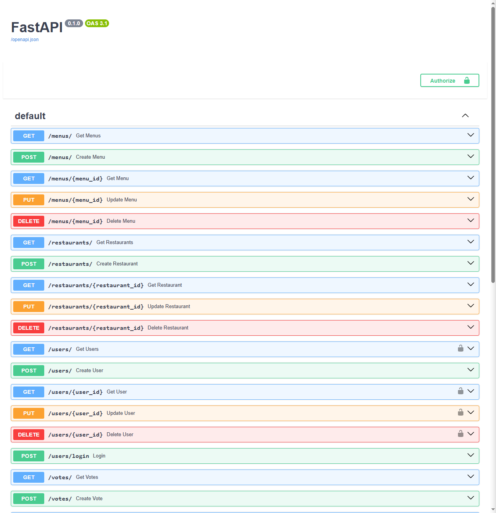

# Fastapi Lunch Voting


## Description
This is a FastAPI-based backend system for an internal employee lunch voting app.


## Technologies Used
- Python
- FastAPI
- PostgreSQL
- JWT
- Docker


## Features
- Authentication system for employees
- Upload and manage daily menus for restaurants
- Display results of daily voting


## Setup
To install the project locally on your computer, execute the following commands in a terminal:
```bash
git clone https://github.com/Illya-Maznitskiy/fastapi-lunch-voting.git
cd fastapi-lunch-voting
python -m venv venv
venv\Scripts\activate (on Windows)
source venv/bin/activate (on macOS)
pip install -r requirements.txt
```


## Testing
Run the following commands to check code style and execute tests:
```bash
flake8
 ```
```bash
cd lunch_voting
python manage.py test
 ```


## Environment Variables
Create a `.env` file in the root directory of the project.
Use the [sample.env](sample.env) file as a reference to add the necessary configurations.


## Database
Ensure you have PostgreSQL installed

Open the terminal and log into PostgreSQL using the following command:
```bash
psql -U postgres
```

Create DB with command:
```bash
CREATE DATABASE fastapi_lunch_voting_db;
```


## Migrations
Create and apply migrations with commands:
```bash
alembic revision --autogenerate -m "Initial migration"
alembic upgrade head
```


## Run the app
- To run the server use the command:
```bash
cd lunch_voting
uvicorn main:app --reload
```
The app will be available at http://localhost:8000.


## API Endpoints
You can check and test the endpoints with URL http://127.0.0.1:8000/docs/


# Screenshots:

### FastAPI docs

